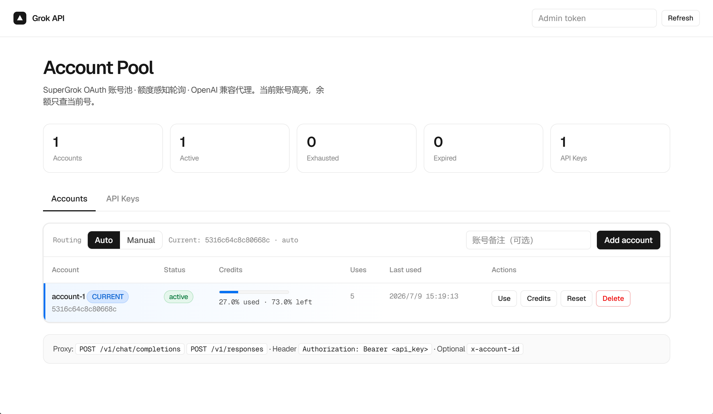
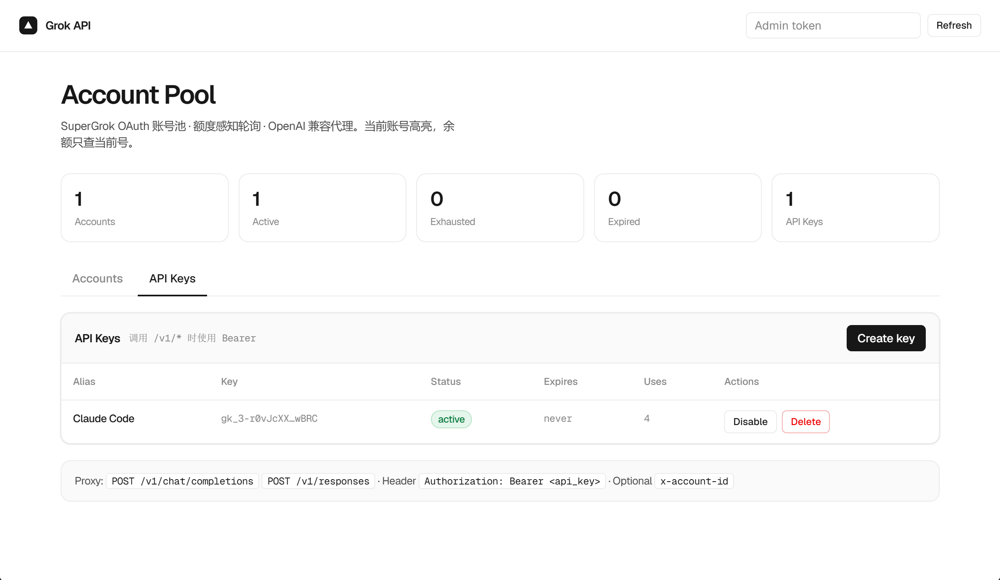
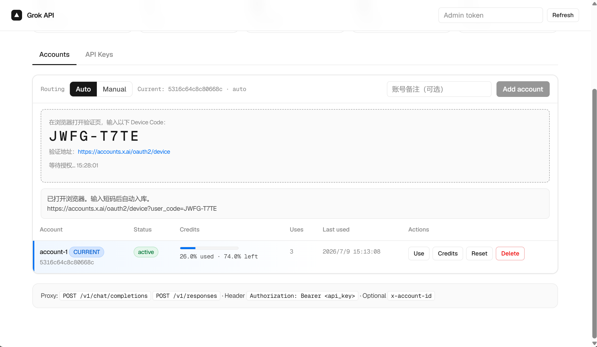

<p align="center">
  
</p>

<h1 align="center">Grok API</h1>

<p align="center">
  <strong>SuperGrok 账号池 · 额度感知路由 · OpenAI 兼容代理</strong><br />
  把多个 SuperGrok OAuth 会话汇成一个本地 API 入口。
</p>

<p align="center">
  <a href="README.md">English</a> ·
  <a href="README_CN.md">简体中文</a>
</p>

<p align="center">
  
  
  
</p>

---

## 截图

| 账号与额度 | API Key | Device Code 授权 |
|:---:|:---:|:---:|
|  |  |  |

---

## 功能

- **多账号 SuperGrok OAuth** — Device Code 登录（不依赖脆弱的本机回跳）
- **额度感知路由** — 实时周额度百分比；**只查当前账号**
- **自动 / 手动模式** — 用尽自动切换，或固定某一账号
- **API Key** — 别名、有效期、一次性展示、SHA-256 落盘
- **OpenAI 兼容代理** — `/v1/chat/completions`、`/v1/responses`、实时 `/v1/models`
- **Vercel 风格管理台** — 中英文切换、可复制 cURL
- **出站代理自动探测** — 环境变量或 Windows 系统代理（**不写死**）

---

## 快速开始

```bash
git clone https://github.com/aaravarr/grok-api.git
cd grok-api
npm install
npm run dev
```

打开 **http://127.0.0.1:8787**

1. **添加账号** → 浏览器完成 Device Code  
2. **创建 API Key**（未创建前 `/v1` 开放；创建后需 Bearer）  
3. 调用代理：

```bash
curl http://127.0.0.1:8787/v1/chat/completions \
  -H "Authorization: Bearer gk_your_key" \
  -H "Content-Type: application/json" \
  -d '{"model":"grok-4.5","messages":[{"role":"user","content":"hello"}]}'
```

```ts
import OpenAI from "openai";

const client = new OpenAI({
  apiKey: "gk_your_key",
  baseURL: "http://127.0.0.1:8787/v1",
});
```

---

## 路由逻辑

```text
请求 →（若有 API Key 则校验）→ 选账号
  手动：固定当前账号
  自动：当前可用则用，否则下一个
→ 仅对该账号查额度（60s 缓存）
→ 注入 OAuth token → api.x.ai
→ 429/402 → 标 exhausted → 自动切下一号
```

`/v1/models` **实时**用当前账号 token 向上游 xAI 拉取，不是写死列表。

---

## 配置

| 变量 | 默认 | 说明 |
|------|------|------|
| `PORT` | `8787` | 端口 |
| `HOST` | `127.0.0.1` | 监听地址 |
| `ADMIN_TOKEN` | 空 | 若设置，则保护 `/api/admin/*`（管理台输入框）。**不是** `/v1` 的 API Key |
| `XAI_BASE_URL` | `https://api.x.ai/v1` | 推理上游 |
| `HTTPS_PROXY` / `HTTP_PROXY` | 自动 | 可选；否则读 Windows 系统代理 |

数据：`data/accounts.json`（已 gitignore）。勿提交 token。

### Admin token 和 API Key 的区别

| | Admin token | API Key（`gk_…`） |
|--|-------------|-------------------|
| 用途 | 保护管理接口 / 管理台 | 调用 `/v1/*` |
| 何时需要 | 仅当设置了 `ADMIN_TOKEN` | 创建过任意 Key 之后 |
| 填写位置 | 环境变量 + 管理台右上角 | 请求头 `Authorization: Bearer` |

未设置 `ADMIN_TOKEN` 时，管理台**不会**显示该输入框。

---

## 代理接口

| 方法 | 路径 |
|------|------|
| `POST` | `/v1/chat/completions` |
| `POST` | `/v1/responses` |
| `GET` | `/v1/models`（实时） |
| `GET` | `/health` |

可选请求头：`x-account-id` 指定上游账号。

---

## 声明

非官方项目，与 xAI 无关。请遵守服务条款，凭证仅保存在本地。

## 许可证

[MIT](LICENSE)
